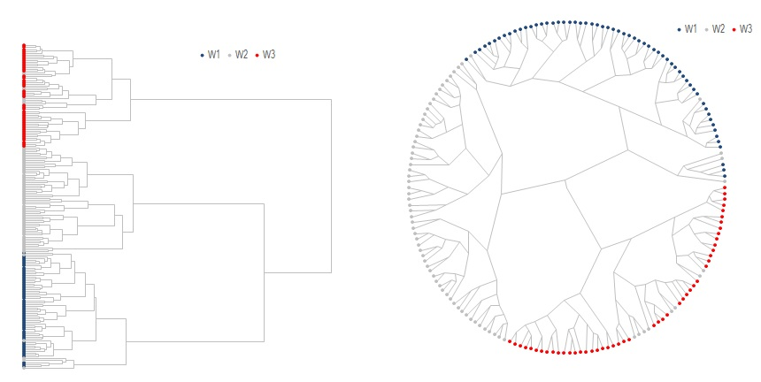
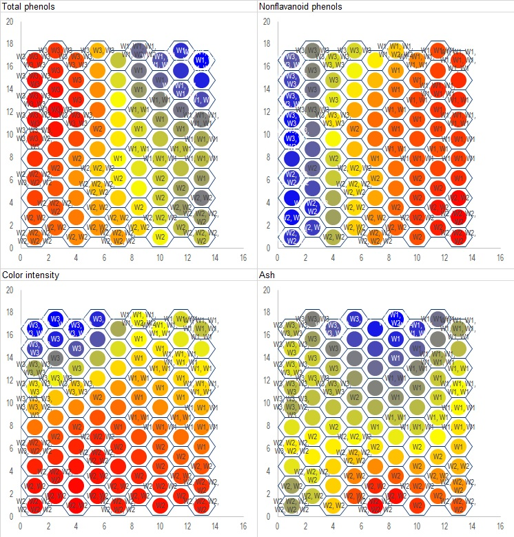
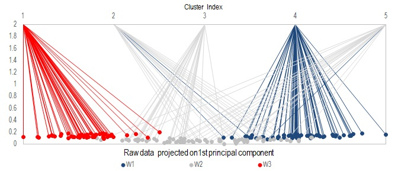
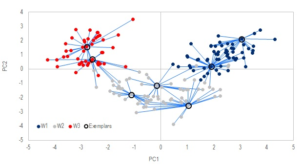
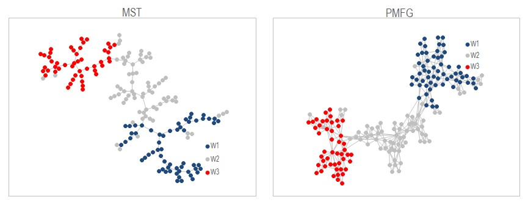
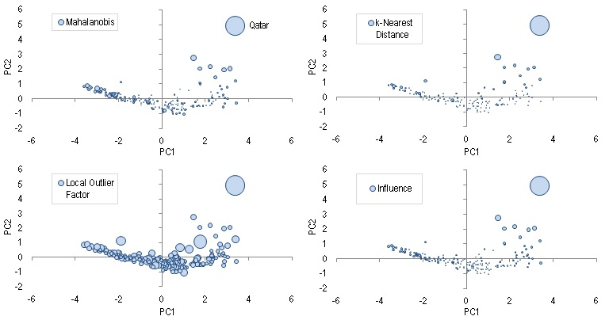
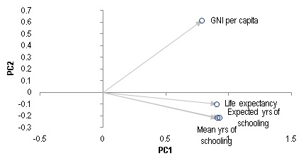

# Scientific Toolkit for VBA

This is a VBA library of basic algorithms commonly used in data analysis. Although there are many state of the art implementations of these algorithms in other languages like Matlab, R or Python, they are not often seen in VBA. While there are good reasons to not use Excel or VBA for these types of analysis, but if you are stuck with Excel either because of budget or IT policy constraints, then hopefully this library can offer a bit of help.

The library was written to aid myself through my (still on-going) learning process, which is why some alogirhtms look redundant and can be replaced by built-in functions in Excel. I just wrote them for the heck of learning it. This is still an ongoing project and better documentations are under construction in [Manual.MD](Manual.MD)

In this Readme, I will showcase some capabilities of this library with a few lines of sample codes. The most basic module is [modMath.bas](Modules/modMath.bas), which contains everything from sorting algorithms to matrix decompositions. It will be a prerequisite for every section that follows. The examples can be found in **SciTool_Master.xlsm** .

## Visualization / Clustering of high dimensional data

Test data here is wine data set from [UCI Machine Learning Repository](https://archive.ics.uci.edu/ml/datasets.html)<sup>1</sup>. It consists of 178 samples of wines made from three different cultivars, which will be named as W1, W2 and W3 in the following sections. 13 attributes of these wine samples were measured, ranging from alchohols content to color intenisty. We want find a way to visualize these 13 dimensions, and use them to classify the 178 samples into clusters.

*1. Forina, M. et al. [UCI Machine Learning Repository](http://archive.ics.uci.edu/ml). Institute of Pharmaceutical and Food Analysis and Technologies. *

First we will import the data, the data should take the form of an array *x()* of size N X D, where N=178 is the number of samples, D=13 is the number of dimensions. We will also have a vector *x_class()* of size N that holds the **true class** (W1, W2 or W3) of each sample.

Data needs to be normalized in most cases. We will use zero mean and unit varaince in this case. The syntax is:
```
Call modmath.Normalize_x(x,x_mean,x_sd,"AVGSD")
```
Now we are ready to explore the data in a number of ways:
 - Principal Component Analysis
 - t-SNE
 - Dendrogram
 - Self-Organizing Map
 - k-Means Clustering
 - Affinity Propagation
 - Minimum Spanning Tree & Planar Maximally Filtered Graph
 - Outliers Detection
 
### Principal Component Analysis
Requires: [cPCA.cls](Modules/cPCA.cls)


```
Dim PCA1 as new cPCA
With PCA1
    Call .PCA(x)                            'Perform PCA transformation
    x_projection = .x_PCA(2)                  'output projection of original data onto the first two components
    Call .BiPlot_Print(Range("I3"), 1, 2)   'output biplot of components 1 & 2
End with
```
The method `.PCA` performs a orthogonal transformation on *x*. The transformed data can then be extracted with method `.x_PCA`. In this case the first 2 components are saved to *x_projection*, which is shown in the left chart above. We also output the biplot of PC1 and PC2 to cell I3, which can be chart in Excel using scatter chart, shown on the right hand side.

Note that the data are color coded above to show the 3 true classes, to aid our evaluation on how well this method works. In a real life situation, we may not know what the true classes are, and one needs to manually define where they want to "slice" the dataset.

### t-SNE (t-Distributed Stochastic Neighbor Embedding)
Requires: [ctSNE.cls](Modules/ctSNE.cls), [cqtree.cls](Modules/cqtree.cls), [cqtree_point.cls](Modules/cqtree_point.cls), [mkdtree.bas](Modules/mkdtree.cls)


While PCA is very simple and efficient, it has limited use when the variables have high-order dependencies ([J Shlens 2014](https://arxiv.org/pdf/1404.1100.pdf)). In that case t-SNE (invented by [Laurens van der Maaten](https://lvdmaaten.github.io/tsne/)) maybe a better option.
```
Dim TS1 As New ctSNE
With TS1
    Call .tSNE_BarnesHut(x, 2)  'Perform t-SNE on raw data onto 2-dimension plane
    y = .Output                 'Output 2D projection of data
    z = .cost_function(True)    'output cost function to see convergence
    Call .Reset                 'release memory
End With
```
There are two methods in this class to perform transformation: `.tSNE` or `.tSNE_BarnesHut`. `.tSNE` is the simplest implementation of the algorithm but can be quite slow. `.tSNE_BarnesHut` uses a quadtree data structure to speed up the process when number of sample N is huge. When N is small, the overhead cost of BarnesHut may not be worth the effort. But for large N~1000 , BarnesHut is essential for a resonable excecution time. The method .Output extract the transformed data which is plotted in the above figures.

Note that random initialization is implemented, and different realizations will converge to different results even when the same hyperparameters are used. The two figures above are from two different runs. Although the charts look different, they both produce similar relative ordering.

### Hierarchical Clustering
Requires: [cHierarchical.cls](Modules/cHierarchical.cls)



```
    x_dist = modMath.Calc_Euclidean_Dist(x, True)   'Pariwise Euclidena distance matrix
    Dim HC1 As New cHierarchical
    With HC1
        Call .NNChainLinkage(x_dist, "WARD", x_class)   'Construct dendogram with Ward's method
        Call .Optimal_leaf_ordering                     'reorder leaf
        Call .Print_Tree(.Range("A2"))               'Print dendogram in normal retangular form
        Call .Print_Tree(.Range("J2"), 2, True)      'Print dendogram in polar form
        .Reset
    End With
    Set HC1 = Nothing
```
The input to this class is a pairwise distance matrix instead of the raw data. We use Euclidean distance here which is calculated using `modMath.Calc_Euclidean_Dist`. The denogram can be built with either `.Linkage` or `.NNChainLinkage` as shown above. The only difference is that `.NNChainLinkage` uses Nearest-Neighbor-Chain to speed up the construction process.

An additional and optional processing step is to reorder the leaves using either `.Optimal_leaf_ordering`<sup>1</sup> or `.MOLO`<sup>2</sup>, to flip each subtree such that similar leaves are more likely to be shown together.

Once done .Print_Tree is used to print the the data in Excel and chart with scatter charts. A polar embedding version of the dendogram is also available, which in some cases may be more aesthetically pleasing. Notice how the 3 distinct branches correspond the the 3 true classes.

1. Fast optimal leaf ordering for hierarchical clustering, Ziv Bar-Joseph et al, 2001
2. dendsort: modular leaf ordering methods for dendrogram representations in R, Ryo Sakai et al, 2014

### SOM (Self-Orgainzing Map)
Requires: [cSOM.cls](Modules/cSOM.cls)



```
    Dim SOM1 As New cSOM
    With SOM1
        Call .Init(9, 10, 13)          'Initialize a 9 by 10 hexagonal grid of nodes in 13 dimension
        Call .SOM_Hex_Train(x)         'Train the network on raw data
        Call .Get_Node_Labels(x_class, node_labels)   'Generate data labels to print on each node
        Call .Print_All_Dimensions(mywkbk.Sheets("SOM"), , , , True, node_labels, factor_labels) 'Create the charts
        Call .Reset
    End With
    Set SOM1 = Nothing
```
The algorithm of SOM itself is rather simple, much of the codes is actually dedicated to drawing the charts since Excel does not directly support plotting on hexagonal grid.

In the sample above .Init is used to initialize a 9 by 10 grid, which is chosen heuristically -  assuming 90 nodes for 178 samples means about 2 samples assigned to each node.
.SOM_Hex_Train does the actual training and assign each datum to its appropriate node.
.Get_node_labels is used to generate node_labels() which can be printed on each node, which is simply a comma-separated list of data points assigned to that node. In cases where a node has too many members, the label may become too long and cannot be shown on a chart. In that case you will need to devise your own way to generate the labels or simply not showing them at all.
.Print_All_Dimension will then create charts on selected Excel worksheet.

Only four out of thirteen attributes are shown above. On each chart, blue means high value in that attribute, red means low, and yellow/green is average. Wines from W1 are mostly placed on the upper-right portion of the grid, W3 on the upper-left, and W2 occupies the lower-half. Compare these to the biplot in the PCA section to see how they rhyme with each other.

### k-Means Clustering
Requires: [ckMeanCluster.cls](Modules/ckMeanCluster.cls), [ckdTree.cls](Modules/ckdTree.cls)

So far the above methods only provide aids to see how the data may be sliced, and which attribute is more relevant in classification than the others. In contrast, k-Means clustering directly separate samples into pre-specified number of clusters.



```
    Dim kM1 As New ckMeanCluster
    With kM1
        Call .kMean_Clustering(x, 5) 'Divide data into 5 clusters
        cluster_index = .x_cluster   'Integer vector of size N, holding the cluster assigment
    End With
```
Use method `.kMean_Clustering` to divide the samples into desired number of clusters. In the example here, let's pretend we do not know there are 3 true classes, and attempt to classify them into 5 groups. The cluster assignment is then returned by `.x_cluster` as an integer vector of size N, with values from 1 to 5.

In the above figure, data was sorted according to their first principal component, color-coded and lines were used to visualize their mapping to the 5 resulting clusters. You can see that samples from the same true class tend to get assigned to the same cluster, which is good. But a few samples from class W1 are assigned to cluster 2, which is dominantly occupied by samples from W2. When you combine this with the PCA analysis, you will notice these "incorrectly" assigned samples are the ones who lie near the boundary of transition from W1 to W2.

Note that k-Means clustering is implemented here with random initialzation, so multiple runs can result in different cluster assignments.

### Affinity Propagation
Requires: [cAffinityPropagation.cls](Modules/cAffinityPropagation.cls)



```
    x_dist = modMath.Calc_Euclidean_Dist(x, True)
    For i = 1 To n_raw - 1
        For j = i + 1 To n_raw
            x_dist(i, j) = -x_dist(i, j)
            x_dist(j, i) = x_dist(i, j)
        Next j
    Next i
    Dim AP1 As New cAffinityPropagation
    With AP1
        Call .Affinity_Propagation(x_dist, , , , "MIN")
        Cluster_index = .Exemplar_index
        Exemplar_List = .Exemplars
        k = .Exemplar_num
        Call .Reset
    End With
    Set AP1 = Nothing
```
The input to this class is a pairwise similarity matrix. In this case we use the negative of Euclidean distance.
Method `.Affinity_Propagation` is the main procedure that finds out which data points are the "exemplars", i.e. members that are the most representative of their groups. `.Exemplars` returns an integer vector that holds the pointers to which data is an exemplar. `.Expemplar_index` returns an integer vector of size N that holds the exemplar assigned to each data point.

The exemplars here are similar to the cluster centers in k-Means method above. But unlike k-Means, the number of exemplars are not prespecified but discovered on the fly. That number is affected by the choice of the fifth argument in `.Affinity_Propagation`, which can be "MIN", "MAX" or "MEDIAN". You may refer to [Frey, 2007](http://www.psi.toronto.edu/affinitypropagation/FreyDueckScience07.pdf)<sup>2</sup> to understand what that means.

In the figures above, the samples with black circles around them are discovered as the exemplars, and the lines map out the samples assigned to each of these exemplars. The 2D mapping was done in PCA, notice how each exemplar tends to sit at the center of its group.

### Minimum Spanning Tree (MST) & Planar Maximally Filtered Graph (PMFG)
Requires: [cGraphAlgo.cls](Modules/cGraphAlgo.cls), [cHeap.cls](Modules/cHeap.cls), [cqtree.cls](Modules/cqtree.cls), [cqtree_point.cls](Modules/cqtree_point.cls), [cPMFG_Graph.cls](Modules/cPMFG_Graph.cls), [cPMFG_lcnode.cls](Modules/cPMFG_lcnode.cls), [cPMFG_ListColl.cls](Modules/cPMFG_ListColl.cls), [cPMFG_Node.cls](Modules/cPMFG_Node.cls), [cPMFG_Stack.cls](Modules/cPMFG_Stack.cls), [cPMFG_VertexRec.cls](Modules/cPMFG_VertexRec.cls), [cPMFG_extFactLinkRec.cls](Modules/cPMFG_extFactLinkRec.cls),[gp.bas](Modules/gp.bas),[gp_Embed.bas](Modules/gp_Embed.bas)



```
    x_dist = modMath.Calc_Euclidean_Dist(x, True)
    Dim G1 As New cGraphAlgo
    With G1
        Call .MST_Build(x_dist)    'if MST needs to be created
        'Call .PMFG_Build(x_dist)   'if PMFG needs to be created
        Call .ForceDirected_MultiLevel  'Optimize graph layout with force directed algorithm
        node_chart = .node_pos
        edge_chart = .Print_Edges
        Call .Reset
    End With
    Set G1 = Nothing
```

Graph is a way to visualize the samples as a network. Each node represents a sample, and it's linked to other nodes by edges, each edge has a weight assigned to it according to how similar a pair is. So in this example where we use Euclidean distance as a measure of similarity, there would be N(N-1)/2 edges in a full graph. It won't be very helpful if we show all these edges in a graph. MST is a way to reduce the edges shown so that only the edges that link the most similar pairs are shown, provided that no cycles are present in the graph. PMFG is similar but less aggressive in the edge reduction process. It allows cycles to appear but makes sure the graph is planar, i.e. the graph can be drawn on a plane without edges crossing each other. So PMFG results in a more detail graph than MST.

The wine samples are shown in the above figures as MST on the left and PMFG on the right. They are created from the pairwise distance matrix using methods `.MST_Build` or `.PMFG_Build` in the class cGraphAlo. `.ForceDirected_MultiLevel` is used to generate a graph layout that's less cluttered. Once done the graph can be output with `.node_pos` and `.Print_edges` which can be chart in Excel.

One big issue in this implementation is that PMFG takes very long time to create. It's using the method from [Boyer and Myrvold, 2004](http://jgaa.info/accepted/2004/BoyerMyrvold2004.8.3.pdf) to check for planarity at every addition of edge. If you are doing anything more than 500 nodes it's just impractical. If you know a faster way to do this please feel free to share with me. I suspect there's no need to run the full planarity test after every additonal edge.

### Outliers Detection

Requires: [mOutliers.bas](Modules/mOutliers.bas)

Upon working on a new data set, it could be worthwhile to scan the dataset for outliers, which can either be erroneous or represent some structural anomalies. For this example, we use a dataset from [Human Development Index](http://hdr.undp.org/en/composite/HDI), which measures 4 areas of developments for 188 countries: life expectancy, mean and expected years of schooling, and Gross National Income (GNI) per capita. The data as of 2015 is put into tabular format in [HDI_Data.csv](HDI_Data.csv). The data is again saved in a NxD array *x()*, where N=188 and D=4, it's then projected onto a 2D-plane of the first two principal components for visualization.

The "outlier-ness" of each data can be meaurserd by these 4 measures: Mahalanobis distance, local outlier factor, distance to the k-th nearest neighbor, and [influence](https://las.inf.ethz.ch/files/lucic16outliers.pdf)<sup>1</sup>. Syntax of each is given below in the same order:
```
x_MD = mOutliers.MahalanobisDist(x)
x_LOF = mOutliers.LOF(x, 5)
x_kNN = mOutliers.KthNeighborDist(x, 5, True)
x_influence = mOutliers.Influence_Iterate(x)
```



The figure above shows the four different outlier scores using bubble size as visual guide. You can see that for all the four charts, Qatar consistently shows a very high outlier score. 



If we want to understand what makes Qatar an outlier, we can look at the PCA Biplot. The position where Qatar sits in the chart is saying that it has a very high per capita GNI relative to other countries with similar level of life expectancy and education. This should comes at no surpise given how much oil Qatar produces.

There is no clear cut-off value on any of these scores to define an outlier. In fact, outlier scores can be distorted by outliers themselves. So it's important to use visualization techniques mentioned in the above sections, together with prior knowledge on the nature of the data to help determine how to handle the data properly.

1. Linear-Time Outlier Detection via Sensitivity, Mario Lucic (2016)


### Tree Map
*Note: As of Excel 2016, Excel has its built-in TreeMap. So this module may be considered obsolete.*

Requires: [cTreeMap.cls](Modules/cTreeMap.cls)


TreeMap is useful in visualizing relative sizes of data that has a hierarchical structure. In this example, we take the GDP of 47 major stock markets from [Worldbank](https://data.worldbank.org/), and manually construct a 3-tier hierarchical structure that groups the countries into Developed markets vs Emerging markets, then with smaller sub-regions down the levels.

Inputs that are require to build a TreeMap include: x_name(1:47) a vector of country names, x_GDP(1:47) a vector of each country's GDP, x_Group(1:47,1:3) an array holding the group that each country belongs to in each of the three levels. The TreeMap can then be build with the following codes:
```
    Set cTree = New cTreeMap
    With cTree
        Call .Create_Multilevel(x_GDP, x_Group, 2, 1)  'Main command to create a 2:1 aspect TreeMap
        vArr = .Draw_Pts               'Center points of each rectangle
        vArr2 = .Draw_Lines            'border lines of each rectangle
        vArr3 = .Draw_Lines_Group(2)   'border lines of 2nd level grouping, can be changed to 1,2 or 3 in this example
        Call .Reset                    'release array memory from object
    End With
    Set cTree = Nothing
```
The arrays vArr, vArr2 and vArr2 can then be printed to an Excel spreadsheet and charted with x-y scatter plot, which gives you what's shown above. In the screenshot I showed both a 1:1 and a 2:1 aspect TreeMap, which will give you a slightly different arrangment of the tiles but essentially the same underlying structure. Alternatively you can also create a treemap wihtout any groupings using the method `.Create(x_GDP)`, which gives you the rightmost chart in the above screenshot.
